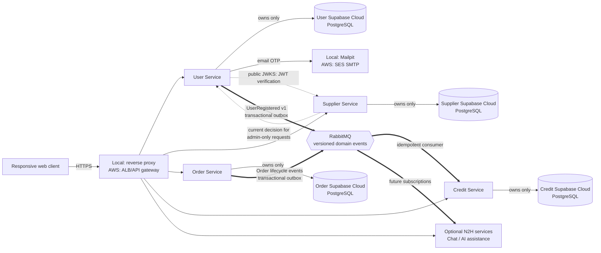
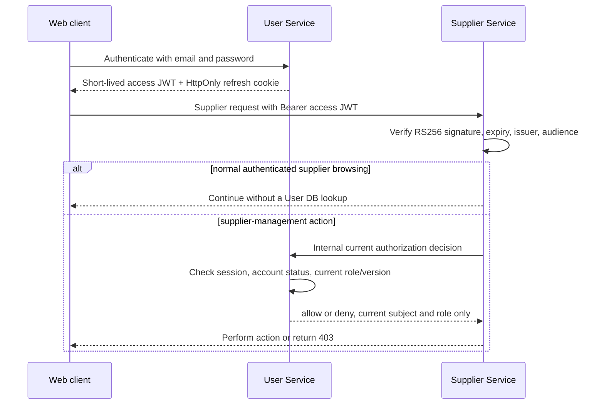

# FoC System Architecture

## Purpose and guiding decisions

Friend on Campus (FoC) is a peer-to-peer campus-errand platform. A single user can create errands as a requester and fulfil errands as a courier; credits are compensation between platform users, never payment to a vendor. The system therefore separates identity, supplier data, errand state, and credit balances into independently deployable services.

The first delivery target is Docker Compose on a developer machine. The same service images, configuration contract, and network boundaries should later move to AWS without changing application code.

| Decision | Selected approach | Why it fits FoC |
| --- | --- | --- |
| Service runtime | Python 3.13, FastAPI, Uvicorn | FastAPI supplies typed Pydantic v2 request validation and explicit dependency-based authentication and authorization guards, while remaining compact and Docker-friendly. |
| Data store | Supabase Cloud PostgreSQL, one Supabase project/database and credential set per service | User identifiers, unique active names/emails, terminal identity tombstones, roles, sessions, audits, and balance/order state need relational constraints and transactions. PostgreSQL supports unique indexes, row locks, migrations, and the expected 35,000-user scale. Each service owns its data and can evolve independently. |
| User persistence access | SQLAlchemy 2 async with `asyncpg`; Supabase CLI SQL migrations | SQLAlchemy models support runtime ORM/query access. Versioned SQL files under `user-service/supabase/migrations/` are the only schema-migration authority, so local, preview, and cloud databases receive the same changes. |
| Authentication | Short-lived RS256 JWT access tokens plus rotating opaque refresh tokens | Other services verify access-token signatures using a public JWKS key, without reading the User database or sharing a signing secret. Refresh tokens are stored only as hashes and can be revoked per session. |
| Asynchronous integration | RabbitMQ topic exchange with transactional outbox/inbox patterns | Registration and order outcomes do not need a synchronous cross-service response. Durable, versioned events avoid cascading failures and enable retry/idempotency. RabbitMQ runs in Compose now and can be replaced by Amazon MQ for RabbitMQ later. |
| Email verification | SMTP adapter: Mailpit locally, Amazon SES SMTP in AWS | The implementation and message format stay the same while local demos have an inspectable inbox and production does not depend on a developer mailbox. |
| Deployment | Docker Compose and Supabase CLI locally; ECR, ECS Fargate, ALB, Supabase Cloud PostgreSQL, Amazon MQ, SES, Secrets Manager, and CloudWatch in production | Containers remain independently deployable; Supabase provides managed PostgreSQL while AWS provides compute, secrets, messaging, email, and logs. |

## High-level system view

The arrow from Supplier Service to User Service is deliberately narrow. Normal authenticated supplier browsing uses local RS256 signature verification, so it does not depend on User Service availability. Before an administrative supplier-management operation, Supplier Service asks User Service for a current authorization decision and fails closed if it cannot receive one. This is the one synchronous exception needed to meet the requirement that a revoked administrator loses administrative access immediately.

## Ownership and coupling rules

| Service | Owns | May synchronously depend on | Publishes / consumes |
| --- | --- | --- | --- |
| User Service | identities, de-identified account tombstones, credentials, sessions, verification challenges, roles, profiles, audit entries, registration outbox in its own Supabase PostgreSQL database | SMTP provider; no product service | Publishes `user.registered.v1`; supplies signed-token public keys and current authorization decisions |
| Supplier Service | supplier records and search indexes | User Service only for current administrative authorization | Does not access User data directly |
| Order Service | errand records, lifecycle history, participant IDs, expiry | Supplier Service only when it must validate an active supplier | Publishes terminal errand lifecycle events |
| Credit Service | wallets, reservations, immutable ledger | None on the critical consumer path | Consumes registration and lifecycle events idempotently |

These rules are non-negotiable:

- A service reads and writes only its own database. There are no cross-service foreign keys, shared ORM models, or cross-database joins.
- Cross-service records carry immutable IDs (for example `userId` and `supplierId`), not copied profiles, passwords, credentials, or other User Service PII.
- HTTP contracts and events are versioned (`/v1`, `*.v1`) and documented separately. A shared contract package may contain JSON schemas and generated types only; it must not become shared domain/business logic.
- Event producers write domain state and an outbox row in one database transaction. Publishers retry pending outbox rows; consumers retain processed event IDs in an inbox/idempotency table before applying a business change.
- All services propagate a correlation ID in HTTP headers and event metadata. Logs exclude passwords, password hashes, OTPs, refresh tokens, and secret configuration.
- Service-to-service calls have short timeouts, bounded retries only for safe requests, and explicit failure behavior. Administrative Supplier operations fail closed; a delayed User Service must not let an unverified privilege change through.

## Account lifecycle and tombstones

User Service owns account deletion. It never physically removes a user row that may be referenced by an Order, Chat, Credit, or future service. Instead, one transaction deletes credentials and sessions; clears username, normalized username, email, normalized email, and email-verification data; replaces the display name with `Deleted User`; increments the role version; and records a terminal `DELETED` status with a deletion timestamp. The stable `userId` and former system role remain only as historical metadata; account status is authoritative, so a tombstone cannot authenticate, refresh, or receive authorization.

The cleared username and email are released for registration by a new account, which always receives a different `userId`. The present User Service schema has no `payment_token`; future PII-bearing fields must be cleared or irreversibly anonymized in the same tombstone transaction. Immutable audit records and cross-service participant IDs remain only where project or legal history requires them.

Order, Chat, and other services retain their own records and immutable participant IDs, but do not receive a Phase 3 deletion event or make a profile-resolution call. They render an unavailable/deleted participant using the local generic label `Deleted User`. If a future service deliberately stores a display-name snapshot, it must define its own anonymization contract; User Service never reads or mutates another service's database.

## Authentication and authorization boundary

The access JWT contains only `sub` (stable user ID), `sid` (session ID), `role`, `roleVersion`, issuer, audience, issued-at, and expiry claims. It contains no email, display name, password-derived data, OTP, or refresh token. User Service checks current server-side state for its own protected endpoints; `DELETED` status and the removed session deny every token even if its expiry has not passed. The Supplier administrative authorization decision likewise checks current server-side state. This avoids trusting user-controlled payloads or an old role claim for an elevated action.

## Local and AWS deployment shape

For local development, Compose starts the reverse proxy, application services, RabbitMQ, and Mailpit. User Service uses `npx supabase start` from `user-service/` for a project-scoped local PostgreSQL/Supabase stack with the same committed SQL migration history as Supabase Cloud; Supabase Auth is neither configured nor used by FoC. `npx supabase db reset` reconstructs that local database from the migration files and seed data. Each service has a Dockerfile, a health check, its own environment variables, and a documented migration command. A developer can rebuild or restart User Service and its local database without rebuilding Supplier, Order, or Credit Service.

For AWS, the same immutable images are built into ECR and deployed as separate ECS Fargate services behind an ALB/API gateway. Services run in private subnets; only the ingress layer is public. Each service connects over TLS to its own Supabase Cloud PostgreSQL project, Amazon MQ hosts the broker, SES sends OTPs, Secrets Manager supplies connection credentials and JWT signing keys, and CloudWatch receives structured logs and metrics. Environment-specific values are injected through configuration and secrets, never committed to source.

## Supabase PostgreSQL connection model

Supabase is a managed PostgreSQL provider, not FoC's identity provider. The web client never receives a Supabase URL, API key, database credential, or Supabase JWT, and User Service never calls Supabase Auth. FastAPI is the only component that creates credentials, validates OTPs, issues FoC access tokens, and makes role decisions.

Each core service receives a separate Supabase project/database. Within the User Service project, the Supabase SQL migrations create a dedicated `user_service` schema plus separate owner and runtime application roles. The FastAPI runtime role receives only the privileges needed for that schema; it cannot access another FoC service's database. FastAPI never applies schema changes on startup and never receives the higher-privilege credentials used by the Supabase CLI or cloud migration workflow.

Local development uses the Supabase CLI's project-scoped local stack. In AWS, persistent ECS Fargate tasks use a TLS-required Supabase Session Pooler connection with a bounded SQLAlchemy pool. Session pooling is appropriate for long-lived services and preserves the prepared-statement and lock behaviour needed by SQLAlchemy and the Super Admin lifecycle. Follow the connection strings generated by the Supabase dashboard rather than constructing them from a region name. [Supabase connection guidance](https://supabase.com/docs/guides/database/connecting-to-postgres)

## Schema migration and GitHub workflow

`user-service/supabase/migrations/` is the sole source of truth for the User Service schema. Developers create each schema change as a timestamped Supabase SQL migration, run it locally with `npx supabase db reset`, and commit it with the application change. SQLAlchemy models mirror the approved schema for queries only; they do not generate or run migrations.

The local project is linked to the cloud `foc-user-service` Supabase project. Supabase GitHub integration is configured for repository `AY2627-CS3219-P6/foc` with working directory `user-service`, so it discovers that migration directory. Automatic branching and production deployment remain disabled until the team has verified the migration workflow. After verification, enable preview branches and then production deployment; Supabase will apply only newly committed migrations to each environment. [Supabase GitHub integration](https://supabase.com/docs/guides/deployment/branching/github-integration)

## Role model

| System role | FoC capability | Scope |
| --- | --- | --- |
| `USER` | May act as both requester and courier with one stable ID; may view and update only their own allowed profile fields; may use normal authenticated supplier browsing | Own profile plus requester/courier and active-supplier workflows |
| `ADMIN` | Includes `USER`; creates, edits, activates, deactivates, and deletes suppliers when Supplier Service confirms current authorization | Supplier-management functions; cannot change administrative roles or another user's protected identity data |
| `SUPER_ADMIN` | Includes `ADMIN`; assigns, promotes, revokes, or demotes administrative roles and performs future account-administration functions | Supplier management plus User Service administrative identity and role lifecycle |

Requester and courier are order-level participant relationships, not separate accounts, profile modes, or privileged system roles. Order Service authorizes each action from the authenticated stable user ID and that order's participant relationship.
